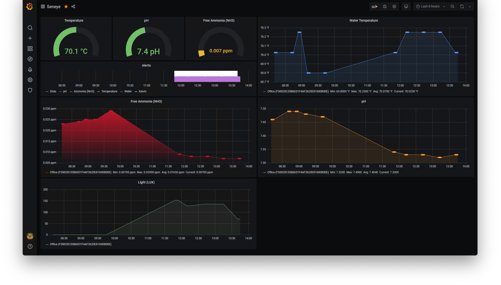
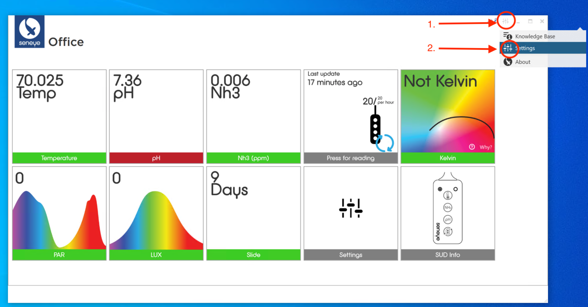
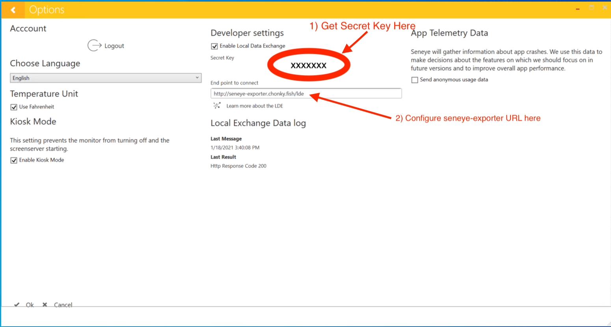

# seneye-exporter

seneye-exporter provides a webserver which listens for measurement pushes from the [Seneye Connect App (SCA)](https://sca.seneye.com/) or [Seneye Web Server (SWS)](https://www.seneye.com/store/seneye-web-server.html) and publishes the results as [prometheus](https://prometheus.io/) metrics. seneye-exporter implements the LDE (Local Data Exchange) protocol. [Prometheus](https://prometheus.io/) is an open-source timeseries database which can collect and store metrics. Using this tool in conjunction with prometheus allows for long-term storage as well as advanced alerting and querying of data collected from the [Seneye USB device (SUD)](https://answers.seneye.com/en/Seneye_Products/seneye_USB_device). Prometheus can be combined with [Grafana](https://grafana.com/) or similar tooling for data visualization.


## Grafana Dashboard
A basic grafana dashboard is available for download via [Grafana dashboard #13735](https://grafana.com/grafana/dashboards/13735).


## Installation (Kubernetes)
First create a namespace and then configure the LDE push secret, found in the Seneye Connect App (SCA) or Seneye Web Server (SWS) settings.
```
kubectl create namespace seneye-exporter
kubectl create secret -n seneye-exporter generic --from-literal=LDE_SECRET=XXXXXXXX seneye-exporter
```
Then apply the kubernetes deployment and service.
```
kubectl apply -f https://raw.githubusercontent.com/jcodybaker/seneye-exporter/main/contrib/k8s/deployment.yaml
kubectl apply -f https://raw.githubusercontent.com/jcodybaker/seneye-exporter/main/contrib/k8s/service.yaml
```

Finally, depending on your environment you may need to configure an kubernetes ingress to expose the seneye-exporter to the Seneye Connect App (SCA) or Seneye Web Server (SWS). An example ingress is provided in [contrib/k8s/ingress.yaml](contrib/k8s/ingress.yaml), but will require modification for your environment.

## Configuring the Seneye Connect App
LDE is configured in the SCA settings, found in the top right.




## seneye-exporter configuration
```
Usage:
  seneye-exporter [flags]

Flags:
      --config string        config file
  -h, --help                 help for seneye-exporter
      --lde-port uint16      Port for LDE server (default 8080)
      --lde-secret strings   Secret used to validate LDE message authenticity. --lde-secret may be specified
                             multiple times if paired with the SUD ID. (ex. --lde-secret=DEFAULT_SECRET, or
                             --lde-secret=EXAMPLE_SUD_ID=SECRET1 --lde-secret=OTHER_SUD_ID=SECRET2)
      --log-format string    log format: "json", "text" (default "text")
      --log-level string     log level: "trace" "debug" "info" 
                             "warn" "error" "fatal" "panic" (default "debug")
      --prom-port uint16     Port for prometheus metrics server (default 9090)
```

## TODO
* Native USB HID driver.
* Light metrics for grafana dashboard
* Instructions for running seneye-exporter, prometheus, and grafana locally via docker-compose.

## Contributions / Bugs
Please use [github pull-requests](https://github.com/jcodybaker/seneye-exporter/pulls) and [issues](https://github.com/jcodybaker/seneye-exporter/issues) to offer [code contributions](https://github.com/jcodybaker/seneye-exporter/pull) or [report bugs](https://github.com/jcodybaker/seneye-exporter/issues).

## License
This code is Copyright [Cody Baker](mailto:cody@codybaker.com) 2021 under the [MIT open-source license](LICENSE). 

## Legal
This software is NOT authorized or endorsed by "seneye ltd", the maker of Seneye devices. "Seneye" is UK registered [trademark owned by "seneye ltd"](https://trademarks.ipo.gov.uk/ipo-tmcase/page/Results/1/UK00909344425).